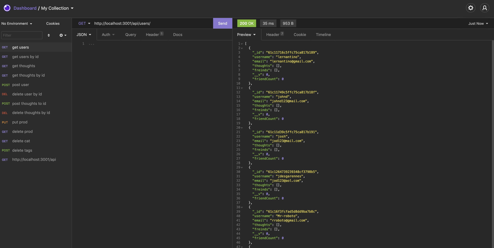

 

  # Title: Social-Network-API

    
  
  ## Description: In this project we will be creating a API that utalizes MongoDB that takes users with their emails and username and can share their thouts, and react to other thoughts. This project will also utalize express and Mongoose packages.

  ## Usage:  Usin Insomnia, the user will demonstrate a API GET call for USERS and Thoughts. The user can Create users and Thoughts. The user can also get  users and thoughts by the unique ID and delete USERS and THOUGHTS by there Unique ID.

  ## Questions: johndesgarennes@gmail.com

  ## Github username: jdesgarennes

  ## Github URL: https://github.com/jdesgarennes/Social-Network-API

  ## VIDEO URL: https://watch.screencastify.com/v/bFscOKm46Drx9FJd76GS
  ## License type: MIT

